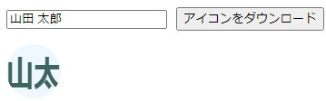
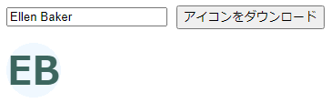
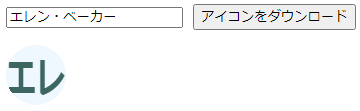

# TypeScriptで名前(文字)が入った丸いアイコン画像を作成する

## 前書き

チャットアプリのデフォルトアイコンとして、名前からアイコンを作成しようと考えました。

Canvasに名前を描画して、丸くくり抜いたものを画像化しています。
## 作成画面イメージ

https://murasuke.github.io/js-name-icon/

* 名前のアイコンを作成してダウンロードします
* スペースで区切っていない場合は、先頭2文字で作成します

 ダウンロード画像 

 ダウンロード画像 

 ダウンロード画像 

## 概要

* 名前からアイコン画像を作成します(.png)。オプションで色やフォントを指定可能
  * スペースを含む場合、splitして最初の2文字を結合する '山田 太郎' -> '山太'。
  * スペースを含まない場合、先頭2文字にする '山田太郎' -> '山田'
* 名前の文字列から、画像（オブジェクトURL）を生成して返します。imgタグのhrefにセットすると画像を表示できます。

```typescript
  const imageUrl = await iconMaker('山田 太郎');
```

### 関数定義

* オプションは指定しなけれれば直径60pxの円でアイコンを作成します。

```typescript
// Icon作成オプション
export type IconOption = {
  size?: number,      // iconのサイズ
  foreColor?: string, // フォントの色
  backColor?: string, // 背景色
  fontScale?: number, // フォントのサイズ(iconのサイズに対する比率(0.7程度が適当))
  fontFamily?: string,// フォントの種類
};

// 関数定義
const iconMaker = async(name: string, option?: IconOption): Promise<string> => {
};

export default iconMaker;
```

## 利用方法

* 作成した画像(png)をダウンロードするには下記のようにします。

* imgタグの.hrefにセットすれば表示も可能です。

```typescript
  const downloadCanvasImage = async() => {
    const imageUrl = await iconMaker(txtName);
    // 画像ダウンロード
    const dlLink = document.createElement("a"); 
    dlLink.href = imageUrl;
    dlLink.download = 'nameicon.png';
    dlLink.click();
    dlLink.remove();  
  };
```

### ソース全体

```typescript
// Icon作成オプション
export type IconOption = {
  size?: number,      // iconのサイズ
  foreColor?: string, // フォントの色
  backColor?: string, // 背景色
  fontScale?: number, // フォントのサイズ(iconのサイズに対する比率(0.7程度が適当))
  fontFamily?: string,// フォントの種類
};


// Icon作成デフォルト値
const defaultValue: IconOption = {
  size: 60,
  foreColor: '#3c665f',
  backColor: 'aliceblue',
  fontScale: 0.7,
  fontFamily: 'sans-serif'
};

const iconMaker = async(name: string, option?: IconOption): Promise<string> => {
  // デフォルト値をoptionのプロパティーで(あれば)上書き
  const opt = {...defaultValue, ...option};
  const [width, height] = [opt.size, opt.size];

  // 描画用のCanvasを用意する
  const canvas = new OffscreenCanvas(width, height);
  const context = canvas.getContext('2d');
  if (!context) throw new Error('could not get context.');

  // スペースを含む場合、splitして最初の2文字を結合する '山田 太郎' -> '山太'。
  // スペースを含まない場合、先頭2文字にする '山田太郎' -> '山田'
  const splitName = name.split(' ');
  const abbrev = (splitName.length >= 2 ? splitName[0].substring(0,1) + splitName[1].substring(0,1) : name.substring(0, 2));
  
  // canvasを円形にくり抜く(clip)
  context.beginPath();
  context.ellipse(width / 2, height / 2, width / 2, height / 2, 0, 0, Math.PI * 2);
  context.closePath();
  context.clip();

  // 背景を塗りつぶす
  context.fillStyle = opt.backColor;
  context.fillRect(0, 0, width * 2, height * 2);

  // 名前を描画
  context.fillStyle = opt.foreColor;
  context.font = `bold ${height * opt.fontScale}px ${opt.fontFamily}`;

  // 文字の中心を合わせる
  const mesure = context.measureText(abbrev);
  const centerX = width - mesure.width > 0 ? (width - mesure.width) / 2 : 0;
  const centerY = (height + mesure.actualBoundingBoxAscent + mesure.actualBoundingBoxDescent) / 2;
  context.fillText(abbrev, centerX, centerY, width);

  // Canvasの画像をオブジェクトURLへ変換(imgタグのhrefにセットすると画像を表示できる)
  const blob = await canvas.convertToBlob();
  const imageUrl = URL.createObjectURL(blob);
  return imageUrl;
};

export default iconMaker;

```